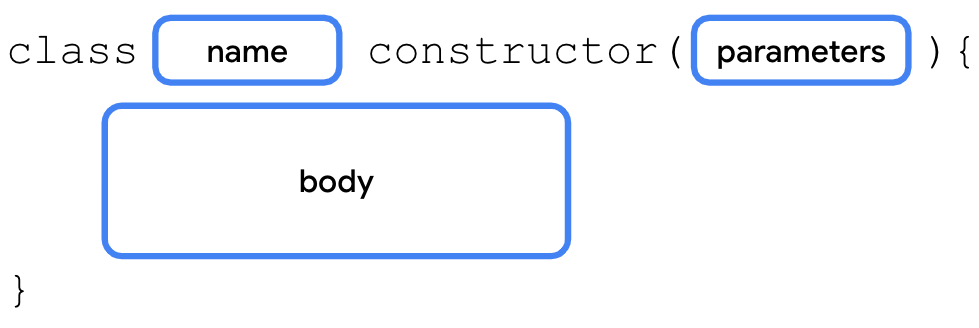

# Use classes and objects in Kotlin

## Define a class

```kt
class SmartDevice {
    // empty body
}

fun main() {
}
```

## Create an instance of a class

```kt
fun main() {
    val smartTvDevice = SmartDevice()
}
```

## Define class methods

```kt
class SmartDevice {
    fun turnOn() {
        println("Smart device is turned on.")
    }

    fun turnOff() {
        println("Smart device is turned off.")
    }
}
```

```kt
fun main() {
    val smartTvDevice = SmartDevice()
    smartTvDevice.turnOn()
    smartTvDevice.turnOff()
}
```

## Define class properties

```kt
class SmartDevice {

    val name = "Android TV"
    val category = "Entertainment"
    var deviceStatus = "online"

    fun turnOn() {
        println("Smart device is turned on.")
    }

    fun turnOff() {
        println("Smart device is turned off.")
    }
}
```

```kt
fun main() {
    val smartTvDevice = SmartDevice()
    println("Device name is: ${smartTvDevice.name}")
    smartTvDevice.turnOn()
    smartTvDevice.turnOff()
}
```

### Getter and setter functions in properties


```kt
var speakerVolume = 2
    get() = field
    set(value) {
        field = value
    }
```

```kt
var speakerVolume = 2
    set(value) {
        if (value in 0..100) {
            field = value
        }
    }
```

## Define a constructor

- Constructors initialize an object and make the object ready for use.

### Default constructor

```kt
class SmartDevice constructor() {
    ...
}
```

- You can remove the `constructor` keyword if there are no annotations or visibility modifiers.
- The Kotlin compiler autogenerates the default `constructor`.

```kt
class SmartDevice {
    ...
}
```

### Define a parameterized constructor

-

```kt
class SmartDevice {

    val name = "Android TV"
    val category = "Entertainment"
    var deviceStatus = "online"

    fun turnOn() {
        println("Smart device is turned on.")
    }

    fun turnOff() {
        println("Smart device is turned off.")
    }
}
```

- In the above `SmartDevice` class, the `name` and `category` properties are immutable.
- With the current implementation, the values for the `name` and `category` properties are hardcoded.
- To maintain immutability but avoid hardcoded values, use a **_parameterized constructor_** to initialize them:

```kt
class SmartDevice(val name: String, val category: String) {

    var deviceStatus = "online"

    fun turnOn() {
        println("Smart device is turned on.")
    }

    fun turnOff() {
        println("Smart device is turned off.")
    }
}
```

```kt
SmartDevice("Android TV", "Entertainment")
SmartDevice(name = "Android TV", category = "Entertainment")
```

## There are two main types of constructors in Kotlin:

### Primary constructor.

A class can have only one primary constructor, which is defined as part of the class header. A primary constructor can be a default or parameterized constructor. The primary constructor doesn't have a body. That means that it can't contain any code.

Primary Contructor Syntax


### Secondary constructor.

A class can have multiple secondary constructors. You can define the secondary constructor with or without parameters. The secondary constructor can initialize the class and has a body, which can contain initialization logic. If the class has a primary constructor, each secondary constructor needs to initialize the primary constructor.

The secondary constructor is enclosed in the body of the class and its syntax includes three parts:

- **Secondary constructor declaration**. The secondary constructor definition starts with the `constructor` keyword followed by parentheses. If applicable, the parentheses contain the parameters required by the secondary constructor.

- **Primary constructor initialization**. The initialization starts with a colon followed by the `this` keyword and a set of parentheses. If applicable, the parentheses contain the parameters required by the primary constructor.

- **Secondary constructor body**. Initialization of the primary constructor is followed by a set of curly braces, which contain the secondary constructor's body.

Secondary Constructor Syntax


Example of a secondary contructor:

```kt
class SmartDevice(val name: String, val category: String) {
    var deviceStatus = "online"

    constructor(name: String, category: String, statusCode: Int) : this(name, category) {
        deviceStatus = when (statusCode) {
            0 -> "offline"
            1 -> "online"
            else -> "unknown"
        }
    }
    ...
}
```

## Implement a relationship between classes (Inheritance)

1. In the `SmartDevice` superclass, add an `open` keyword before the `class` keyword to make it extendable:

```kt
open class SmartDevice(val name: String, val category: String) {
    ...
}
```

2. Create a `SmartTvDevice` subclass that extends the `SmartDevice` superclass:

```kt
class SmartTvDevice(deviceName: String, deviceCategory: String) :
    SmartDevice(name = deviceName, category = deviceCategory) {
}
```

> The `constructor` definition for `SmartTvDevice` doesn't specify whether the properties are _mutable_ or _immutable_. This means that the `deviceName` and `deviceCategory` parameters are merely `constructor` parameters instead of class properties. You won't be able to use them in the class, but simply pass them to the superclass constructor.

```kt
class SmartTvDevice(deviceName: String, deviceCategory: String) :
    SmartDevice(name = deviceName, category = deviceCategory) {

    var speakerVolume = 2
        set(value) {
            if (value in 0..100) {
                field = value
            }
        }

    var channelNumber = 1
        set(value) {
            if (value in 0..200) {
                field = value
            }
        }

    fun increaseSpeakerVolume() {
        speakerVolume++
        println("Speaker volume increased to $speakerVolume.")
    }

    fun nextChannel() {
        channelNumber++
        println("Channel number increased to $channelNumber.")
    }
}
```

```kt
// Smart Light Device IS-A smart device.
class SmartLightDevice(deviceName: String, deviceCategory: String) :
    SmartDevice(name = deviceName, category = deviceCategory) {

    var brightnessLevel = 0
        set(value) {
            if (value in 0..100) {
                field = value
            }
        }

    fun increaseBrightness() {
        brightnessLevel++
        println("Brightness increased to $brightnessLevel.")
    }
}
```

```kt
// The SmartHome class HAS-A smart TV device and smart light.
class SmartHome(
    val smartTvDevice: SmartTvDevice,
    val smartLightDevice: SmartLightDevice
) {

    ...

    fun changeTvChannelToNext() {
        smartTvDevice.nextChannel()
    }

    fun turnOnLight() {
        smartLightDevice.turnOn()
    }

    fun turnOffLight() {
        smartLightDevice.turnOff()
    }

    fun increaseLightBrightness() {
        smartLightDevice.increaseBrightness()
    }
}
```

### Override superclass methods from subclasses

1. In the body of the `SmartDevice` superclass before the `fun` keyword of each method, add an `open` keyword:

```kt
open class SmartDevice(val name: String, val category: String) {

    var deviceStatus = "online"

    open fun turnOn() {
        // function body
    }

    open fun turnOff() {
        // function body
    }
}
```

2. In the body of the `SmartLightDevice` class, define (override) `turnOn()` and `turnOff()` methods:

```kt
class SmartLightDevice(deviceName: String, deviceCategory: String) :
    SmartDevice(name = deviceName, category = deviceCategory) {

    var brightnessLevel = 0
        set(value) {
            if (value in 0..100) {
                field = value
            }
        }

    fun increaseBrightness() {
        brightnessLevel++
        println("Brightness increased to $brightnessLevel.")
    }

    override fun turnOn() {
        deviceStatus = "on"
        brightnessLevel = 2
        println("$name turned on. The brightness level is $brightnessLevel.")
    }

    override fun turnOff() {
        deviceStatus = "off"
        brightnessLevel = 0
        println("Smart Light turned off")
    }
}
```

3. In the body of the `SmartTvDevice` class, define (override) `turnOn()` and `turnOff()` methods:

```kt
class SmartTvDevice(deviceName: String, deviceCategory: String) :
    SmartDevice(name = deviceName, category = deviceCategory) {

    var speakerVolume = 2
        set(value) {
            if (value in 0..100) {
                field = value
            }
        }

    var channelNumber = 1
        set(value) {
            if (value in 0..200) {
                field = value
            }
        }

    fun increaseSpeakerVolume() {
        speakerVolume++
        println("Speaker volume increased to $speakerVolume.")
    }

    fun nextChannel() {
        channelNumber++
        println("Channel number increased to $channelNumber.")
    }

    override fun turnOn() {
        deviceStatus = "on"
        println(
            "$name is turned on. Speaker volume is set to $speakerVolume and channel number is " +
                "set to $channelNumber."
        )
    }

    override fun turnOff() {
        deviceStatus = "off"
        println("$name turned off")
    }
}
```

4. Instantiate the sub classes

```kt
fun main() {
    var smartDevice: SmartDevice = SmartTvDevice("Android TV", "Entertainment")
    smartDevice.turnOn()

    smartDevice = SmartLightDevice("Google Light", "Utility")
    smartDevice.turnOn()
}
```

To call the overridden method in the superclass from the subclass, you need to use the `super` keyword.

Updated version of super class (`SmartDevice`):

```kt
open class SmartDevice(val name: String, val category: String) {

    var deviceStatus = "online"

    open fun turnOn() {
        deviceStatus = "on"
    }

    open fun turnOff() {
        deviceStatus = "off"
    }
}
```

Updated version of `SmartTvDevice`:

```kt
class SmartTvDevice(deviceName: String, deviceCategory: String) :
    SmartDevice(name = deviceName, category = deviceCategory) {

    var speakerVolume = 2
        set(value) {
            if (value in 0..100) {
                field = value
            }
        }

     var channelNumber = 1
        set(value) {
            if (value in 0..200) {
                field = value
            }
        }

    fun increaseSpeakerVolume() {
        speakerVolume++
        println("Speaker volume increased to $speakerVolume.")
    }

    fun nextChannel() {
        channelNumber++
        println("Channel number increased to $channelNumber.")
    }

    override fun turnOn() {
        super.turnOn()
        println(
            "$name is turned on. Speaker volume is set to $speakerVolume and channel number is " +
                "set to $channelNumber."
        )
    }

    override fun turnOff() {
        super.turnOff()
        println("$name turned off")
    }
}
```

Updated version of `SmartLightDevice`:

```kt
class SmartLightDevice(deviceName: String, deviceCategory: String) :
    SmartDevice(name = deviceName, category = deviceCategory) {

    var brightnessLevel = 0
        set(value) {
            if (value in 0..100) {
                field = value
            }
        }

    fun increaseBrightness() {
        brightnessLevel++
        println("Brightness increased to $brightnessLevel.")
    }

    override fun turnOn() {
        super.turnOn()
        brightnessLevel = 2
        println("$name turned on. The brightness level is $brightnessLevel.")
    }

    override fun turnOff() {
        super.turnOff()
        brightnessLevel = 0
        println("Smart Light turned off")
    }
}
```

### Override superclass properties from subclasses

```kt
open class SmartDevice(val name: String, val category: String) {

    var deviceStatus = "online"

    open val deviceType = "unknown"
    ...
}
```

```kt
class SmartTvDevice(deviceName: String, deviceCategory: String) :
    SmartDevice(name = deviceName, category = deviceCategory) {

    override val deviceType = "Smart TV"

    ...
}
```

```kt
class SmartLightDevice(deviceName: String, deviceCategory: String) :
    SmartDevice(name = deviceName, category = deviceCategory) {

    override val deviceType = "Smart Light"

    ...

}
```

## Visibility modifiers

- `public`. Default visibility modifier. Makes the declaration accessible everywhere. The properties and methods that you want used outside the class are marked as `public`.
- `private`. Makes the declaration accessible in the same class or source file.
- `protected`. Makes the declaration accessible in subclasses. The properties and methods that you want used in the class that defines them and the subclasses are marked with the `protected` visibility modifier.
- `internal`. Makes the declaration accessible in the same module. The internal modifier is similar to `private`, but you can access internal properties and methods from outside the class as long as it's being accessed in the same module.

> Note: A **_module_** is a collection of source files and build settings that let you divide your project into discrete units of functionality. Your project can have one or many modules. You can independently build, test, and debug each module.

> A **_package_** is like a directory or a folder that groups related classes, whereas a module provides a container for your app's source code, resource files, and app-level settings. A module can contain multiple packages.

### Specify a visibility modifier for properties

```kt
open class SmartDevice(val name: String, val category: String) {

    ...

    private var deviceStatus = "online"

    ...
}
```

- You can also set the visibility modifiers to setter functions.

```kt
open class SmartDevice(val name: String, val category: String) {

    ...

    var deviceStatus = "online"
        protected set(value) {
           field = value
       }

    ...
}
```

- Only the class and its children should be able to update or write the value
- This is similar to the default implementation for property setters, so, you can omit the parentheses and body of the `set()`

```kt
open class SmartDevice(val name: String, val category: String) {

    ...

    var deviceStatus = "online"
        protected set

    ...
}
```

### Visibility modifiers for methods

```kt
class SmartTvDevice(deviceName: String, deviceCategory: String) :
    SmartDevice(name = deviceName, category = deviceCategory) {

    ...

    protected fun nextChannel() {
        channelNumber++
        println("Channel number increased to $channelNumber.")
    }

    ...
}
```

### Visibility modifiers for constructors

Syntax:


Example:

```kt
open class SmartDevice protected constructor (val name: String, val category: String) {

    ...

}
```

### Visibility modifiers for classes

```kt
internal open class SmartDevice(val name: String, val category: String) {

    ...

}
```

| Modifier  | Accessible in same class | Accessible in subclass | Accessible in same module | Accessible outside module |
| --------- | ------------------------ | ---------------------- | ------------------------- | ------------------------- |
| private   | ✔                        | 𝗫                      | 𝗫                         | 𝗫                         |
| protected | ✔                        | ✔                      | 𝗫                         | 𝗫                         |
| internal  | ✔                        | ✔                      | ✔                         | 𝗫                         |
| public    | ✔                        | ✔                      | ✔                         | ✔                         |

- Add the appropriate visibility modifiers to the `SmartTvDevice` and `SmartLightDevice` subclasses:

```kt
class SmartTvDevice(deviceName: String, deviceCategory: String) :
    SmartDevice(name = deviceName, category = deviceCategory) {

    private var speakerVolume = 2
        set(value) {
            if (value in 0..100) {
                field = value
            }
        }

    private var channelNumber = 1
        set(value) {
            if (value in 0..200) {
                field = value
            }
        }

    ...
}
```

```kt
class SmartLightDevice(deviceName: String, deviceCategory: String) :
    SmartDevice(name = deviceName, category = deviceCategory) {

    ...

    private var brightnessLevel = 0
        set(value) {
            if (value in 0..100) {
                field = value
            }
        }

    ...
}
```

## Define property delegates

Syntax:


- To create the delegate class for the `var` type, you need to implement the `ReadWriteProperty` interface.
- Similarly, you need to implement the `ReadOnlyProperty` interface for the `val` type.

### Create the delegate for the var type:

1. Create a `RangeRegulator` class that implements the `ReadWriteProperty<Any?, Int>` interface:

```kt
class RangeRegulator() : ReadWriteProperty<Any?, Int> {

}

fun main() {
    ...
}
```

2. In the `RangeRegulator` class's primary constructor, add an `initialValue` parameter, a private `minValue` property, and a private `maxValue` property, all of `Int` type:

```kt
class RangeRegulator(
    initialValue: Int,
    private val minValue: Int,
    private val maxValue: Int
) : ReadWriteProperty<Any?, Int> {

}
```

3. In the `RangeRegulator` class's body, override the `getValue()` and `setValue()` methods:

```kt
class RangeRegulator(
    initialValue: Int,
    private val minValue: Int,
    private val maxValue: Int
) : ReadWriteProperty<Any?, Int> {

    override fun getValue(thisRef: Any?, property: KProperty<*>): Int {
    }

    override fun setValue(thisRef: Any?, property: KProperty<*>, value: Int) {
    }
}
```

> Note: The `KProperty` is an interface that represents a declared property and lets you access the metadata on a delegated property.

4. In the `RangeRegulator` class, on the line before the `getValue()` method, define a `fieldData` property and initialize it with `initialValue` parameter:

```kt
class RangeRegulator(
    initialValue: Int,
    private val minValue: Int,
    private val maxValue: Int
) : ReadWriteProperty<Any?, Int> {

    var fieldData = initialValue

    override fun getValue(thisRef: Any?, property: KProperty<*>): Int {
    }

    override fun setValue(thisRef: Any?, property: KProperty<*>, value: Int) {
    }
}
```

5. Final code:

```kt
class RangeRegulator(
    initialValue: Int,
    private val minValue: Int,
    private val maxValue: Int
) : ReadWriteProperty<Any?, Int> {

    var fieldData = initialValue

    override fun getValue(thisRef: Any?, property: KProperty<*>): Int {
        return fieldData
    }

    override fun setValue(thisRef: Any?, property: KProperty<*>, value: Int) {
        if (value in minValue..maxValue) {
            fieldData = value
        }
    }
}
```

6. In the `SmartTvDevice` class, use the delegate class to define the `speakerVolume` and `channelNumber` properties:

```kt
class SmartTvDevice(deviceName: String, deviceCategory: String) :
    SmartDevice(name = deviceName, category = deviceCategory) {

    override val deviceType = "Smart TV"

    private var speakerVolume by RangeRegulator(initialValue = 2, minValue = 0, maxValue = 100)

    private var channelNumber by RangeRegulator(initialValue = 1, minValue = 0, maxValue = 200)

    ...

}
```

7. In the `SmartLightDevice` class, use the delegate class to define the `brightnessLevel` property:

```kt
class SmartLightDevice(deviceName: String, deviceCategory: String) :
    SmartDevice(name = deviceName, category = deviceCategory) {

    override val deviceType = "Smart Light"

    private var brightnessLevel by RangeRegulator(initialValue = 0, minValue = 0, maxValue = 100)

    ...

}
```

## Complete Code

```kt
import kotlin.properties.ReadWriteProperty
import kotlin.reflect.KProperty

open class SmartDevice(val name: String, val category: String) {

    var deviceStatus = "online"
        protected set

    open val deviceType = "unknown"

    open fun turnOn() {
        deviceStatus = "on"
    }

    open fun turnOff() {
        deviceStatus = "off"
    }
}

class SmartTvDevice(deviceName: String, deviceCategory: String) :
    SmartDevice(name = deviceName, category = deviceCategory) {

    override val deviceType = "Smart TV"

    private var speakerVolume by RangeRegulator(initialValue = 2, minValue = 0, maxValue = 100)

    private var channelNumber by RangeRegulator(initialValue = 1, minValue = 0, maxValue = 200)

    fun increaseSpeakerVolume() {
        speakerVolume++
        println("Speaker volume increased to $speakerVolume.")
    }

    fun nextChannel() {
        channelNumber++
        println("Channel number increased to $channelNumber.")
    }

    override fun turnOn() {
        super.turnOn()
        println(
            "$name is turned on. Speaker volume is set to $speakerVolume and channel number is " +
                "set to $channelNumber."
        )
    }

    override fun turnOff() {
        super.turnOff()
        println("$name turned off")
    }
}

class SmartLightDevice(deviceName: String, deviceCategory: String) :
    SmartDevice(name = deviceName, category = deviceCategory) {

    override val deviceType = "Smart Light"

    private var brightnessLevel by RangeRegulator(initialValue = 0, minValue = 0, maxValue = 100)

    fun increaseBrightness() {
        brightnessLevel++
        println("Brightness increased to $brightnessLevel.")
    }

    override fun turnOn() {
        super.turnOn()
        brightnessLevel = 2
        println("$name turned on. The brightness level is $brightnessLevel.")
    }

    override fun turnOff() {
        super.turnOff()
        brightnessLevel = 0
        println("Smart Light turned off")
    }
}

class SmartHome(
    val smartTvDevice: SmartTvDevice,
    val smartLightDevice: SmartLightDevice
) {

    var deviceTurnOnCount = 0
        private set

    fun turnOnTv() {
        deviceTurnOnCount++
        smartTvDevice.turnOn()
    }

    fun turnOffTv() {
        deviceTurnOnCount--
        smartTvDevice.turnOff()
    }

    fun increaseTvVolume() {
        smartTvDevice.increaseSpeakerVolume()
    }

    fun changeTvChannelToNext() {
        smartTvDevice.nextChannel()
    }

    fun turnOnLight() {
        deviceTurnOnCount++
        smartLightDevice.turnOn()
    }

    fun turnOffLight() {
        deviceTurnOnCount--
        smartLightDevice.turnOff()
    }

    fun increaseLightBrightness() {
        smartLightDevice.increaseBrightness()
    }

    fun turnOffAllDevices() {
        turnOffTv()
        turnOffLight()
    }
}

class RangeRegulator(
    initialValue: Int,
    private val minValue: Int,
    private val maxValue: Int
) : ReadWriteProperty<Any?, Int> {

    var fieldData = initialValue

    override fun getValue(thisRef: Any?, property: KProperty<*>): Int {
        return fieldData
    }

    override fun setValue(thisRef: Any?, property: KProperty<*>, value: Int) {
        if (value in minValue..maxValue) {
            fieldData = value
        }
    }
}

fun main() {
    var smartDevice: SmartDevice = SmartTvDevice("Android TV", "Entertainment")
    smartDevice.turnOn()

    smartDevice = SmartLightDevice("Google Light", "Utility")
    smartDevice.turnOn()
}
```
