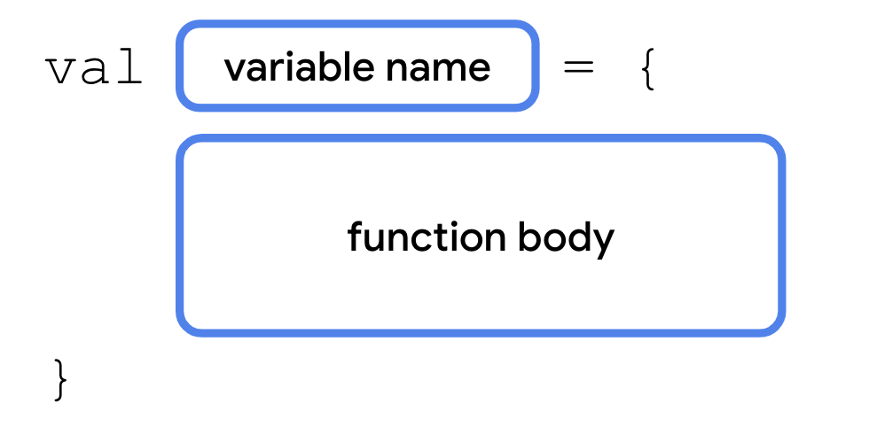
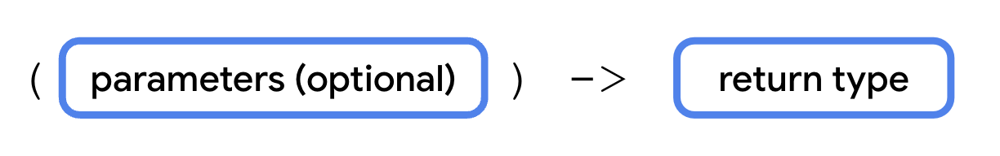
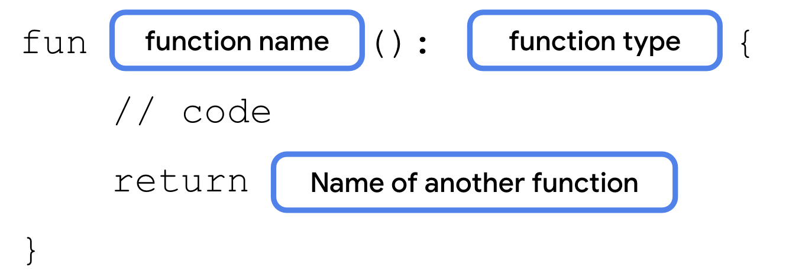
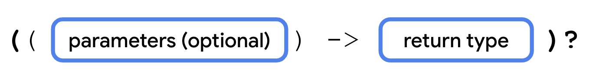
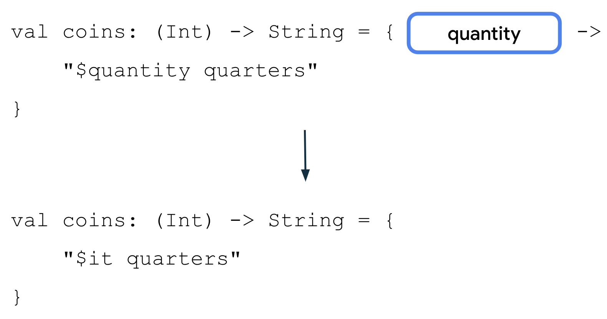
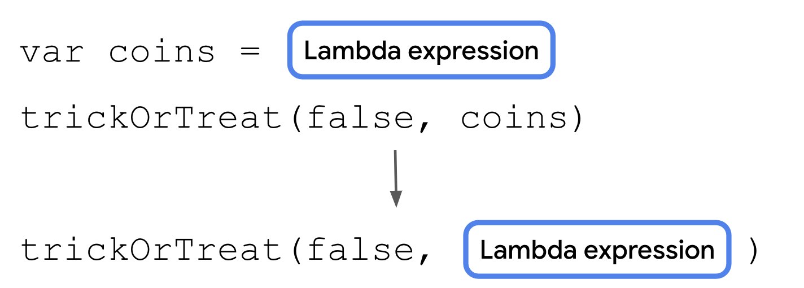
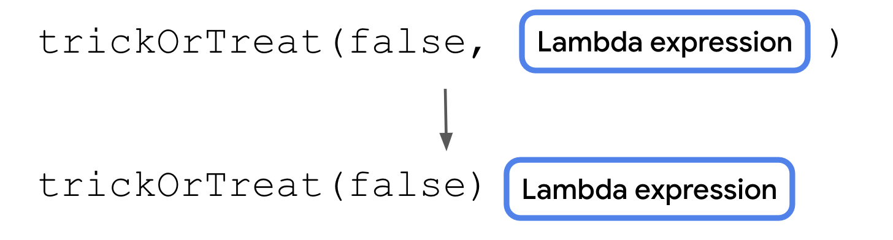
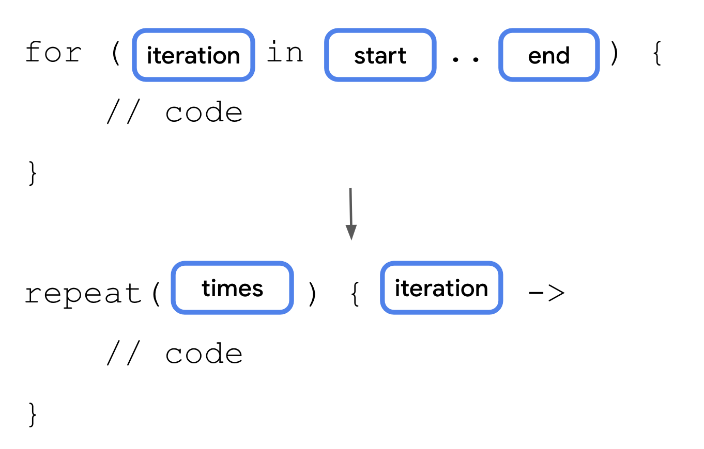

# Use function types and lambda expressions in Kotlin

> In Kotlin, functions are considered **_first-class constructs_**. This means that functions can be treated as a **_data type_**. You can store functions in variables, pass them to other functions as arguments, and return them from other functions.

> Like other data types that you can express with literal values—such as an `Int` type of a `10` value and a `String` type of a `"Hello"` value—you can also declare function literals, which are called **_lambda expressions_** or **_lambdas_** for short.

## Function reference operator (`::`)

```kt
fun main() {
    val trickFunction = trick
}

fun trick() {
    println("No treats!")
}
```

Output (Error):

```bash
Function invocation 'trick()' expected
```

- You tried to store trick in the `trickFunction` variable. However, to refer to a function as a value, you need to use the function reference operator (`::`).

Corrected Code

```kt
fun main() {
    val trickFunction = ::trick
}

fun trick() {
    println("No treats!")
}
```

## Redefine the function with a lambda expression

- **Lambda expressions** provide a concise syntax to define a function without the `fun` keyword. You can store a lambda expression directly in a variable without a function reference on another function.

The syntax is:



Rewrite the `trick()` function with a **lambda expression**

```kt
fun main() {
    // We can remove the function reference operator (::)
    val trickFunction = trick
}

// The function is replaced with lambda expression
val trick = {
    println("No treats!")
}
```

In the `main()` function, call the `trick()` function:

```kt
fun main() {
    val trickFunction = trick
    trick()
}

val trick = {
    println("No treats!")
}
```

In the main() function, call the trickFunction variable as if it were a function

```kt
fun main() {
    val trickFunction = trick
    trick()
    trickFunction()
}

val trick = {
    println("No treats!")
}
```

## Syntax for expressing function types.



- The data type of the `trick` variable that you declared earlier would be `() -> Unit`.

- The function doesn't have any parameters and doesn't return anything (`Unit`)

1. Another Example

```kt
val trick = {
    println("No treats!")
}

val treat = {
    println("Have a treat!")
}
```

2. Specify the `treat` variable's data type as `() -> Unit.`

```kt
val treat: () -> Unit = {
    println("Have a treat!")
}
```

## Use a function as a return type

Syntax:


```kt
fun main() {
    val treatFunction = trickOrTreat(false)
    val trickFunction = trickOrTreat(true)
    treatFunction()
    trickFunction()
}

// This function returns `trick` or `treat` function
fun trickOrTreat(isTrick: Boolean): () -> Unit {
    if (isTrick) {
        return trick
    } else {
        return treat
    }
}

val trick = {
    println("No treats!")
}

val treat = {
    println("Have a treat!")
}
```

Output:

```bash
Have a treat!
No treats!
```

## Pass a function to another function as an argument

```kt
fun trickOrTreat(isTrick: Boolean, extraTreat: (Int) -> String): () -> Unit {
    if (isTrick) {
        return trick
    } else {
        println(extraTreat(5))
        return treat
    }
}

fun main() {
    val coins: (Int) -> String = { quantity ->
        "$quantity quarters"
    }

    val cupcake: (Int) -> String = {
        "Have a cupcake!"
    }

    val treatFunction = trickOrTreat(false, coins)
    val trickFunction = trickOrTreat(true, cupcake)
    treatFunction()
    trickFunction()
}
```

Output:

```bash
5 quarters
Have a treat!
No treats!
```

## Nullable function types

Syntax:


```kt
fun trickOrTreat(isTrick: Boolean, extraTreat: ((Int) -> String)?): () -> Unit {
    if (isTrick) {
        return trick
    } else {
        if (extraTreat != null) {
            println(extraTreat(5))
        }
        return treat
    }
}
```

## Write lambda expressions with shorthand syntax

### Omit parameter name



### Pass a lambda expression directly into a function



1. Move the lambda expression so that it's passed directly into the call to the `trickOrTreat()` function.

```kt
fun main() {
    val coins: (Int) -> String = {
        "$it quarters"
    }
    val treatFunction = trickOrTreat(false, { "$it quarters" })
    val trickFunction = trickOrTreat(true, null)
    treatFunction()
    trickFunction()
}
```

2. Remove the `coins` variable because it's no longer being used.

```kt
fun main() {
    val treatFunction = trickOrTreat(false, { "$it quarters" })
    val trickFunction = trickOrTreat(true, null)
    treatFunction()
    trickFunction()
}
```

### Use trailing lambda syntax

Syntax:


```kt
// val treatFunction = trickOrTreat(false, { "$it quarters" })
val treatFunction = trickOrTreat(false) { "$it quarters" }
```

### Use the `repeat()` function

- When a function returns a function or takes a function as an argument, it's called a **_higher-order function_**.

- `trickOrTreat()` function is an example of a higher-order function

- Kotlin provides several useful higher-order functions.

- The `repeat()` function is one such higher-order function.

```kt
repeat(times: Int, action: (Int) -> Unit)
```

Syntax:


```kt
fun main() {
    val treatFunction = trickOrTreat(false) { "$it quarters" }
    val trickFunction = trickOrTreat(true, null)
    repeat(4) {
        treatFunction()
    }
    trickFunction()
}
```

Output:

```bash
5 quarters
Have a treat!
Have a treat!
Have a treat!
Have a treat!
No treats!
```
