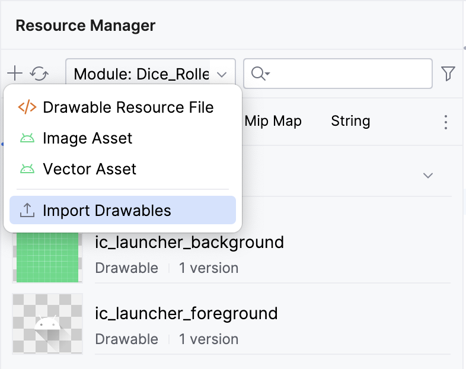

# Create an interactive Dice Roller app

## 1. Establish a baseline

### Create a Project

1. In Android Studio, click **File** > **New** > **New Project**.
2. In the **New Project** dialog, select **Empty Activity** and then click **Next**.
3. In the **Name** field, enter **Dice Roller**.
4. In the **Minimum SDK** field, select a minimum API level of 24 (Nougat) from the menu and then click **Finish**.

## 2. Create the layout infrastructure

### Preview the Project

1. Click **Build & Refresh** in the **Split** or **Design** pane.
2. Now you should see a preview in the **Design** pane.

### Restructure the sample code

1. Remove the `GreetingPreview()` function.
2. Create a `DiceWithButtonAndImage()` function with the `@Composable` annotation.
3. Remove the `Greeting(name: String, modifier: Modifier = Modifier)` function.
4. Create a `DiceRollerApp()` function with the `@Preview` and `@Composable` annotations.

File: `MainActivity.kt`

```kt
@Preview
@Composable
fun DiceRollerApp() {

}

@Composable
fun DiceWithButtonAndImage() {

}
```

5. Delete all of the code inside the `setContent{}` lambda found in the `onCreate()` method.
6. In the `setContent{}` lambda body, call the `DiceRollerTheme{}` lambda and then inside the `DiceRollerTheme{}` lambda, call the `DiceRollerApp()` function.

```kt
override fun onCreate(savedInstanceState: Bundle?) {
    super.onCreate(savedInstanceState)
    setContent {
        DiceRollerTheme {
            DiceRollerApp()
        }
    }
}
```

7. In the `DiceRollerApp()` function, call the `DiceWithButtonAndImage()` function.

```kt
@Preview
@Composable
fun DiceRollerApp() {
    DiceWithButtonAndImage()
}
```

8. Modify the `DiceWithButtonAndImage()` function to accept a `modifier` argument of type `Modifier` and assign it a default value of `Modifier`.

```kt
@Composable
fun DiceWithButtonAndImage(modifier: Modifier = Modifier) {
}
```

9. Chain a `fillMaxSize()` method onto the `Modifier` object so that the layout fills the entire screen.

```kt
DiceWithButtonAndImage(modifier = Modifier
    .fillMaxSize()
)
```

10. Chain the `wrapContentSize()` method onto the `Modifier` object and then pass `Alignment.Center` as an argument to center the components.

```kt
DiceWithButtonAndImage(modifier = Modifier
    .fillMaxSize()
    .wrapContentSize(Alignment.Center)
)
```

## 3. Create a vertical layout

1. In the `DiceWithButtonAndImage()` function, add a `Column()` function.
2. Pass the `modifier` argument from the `DiceWithButtonAndImage()` method signature to the `Column()`'s `modifier` argument.
3. Pass a `horizontalAlignment` argument to the `Column()` function and then set it to a value of `Alignment.CenterHorizontally`.

```kt
fun DiceWithButtonAndImage(modifier: Modifier = Modifier) {
    Column (
        modifier = modifier,
        horizontalAlignment = Alignment.CenterHorizontally
    ) {}
}
```

## 4. Add a button

1. In the `strings.xml` file, add a string and set it to a `Roll` value.
   `res/values/strings.xml`

```xml
<string name="roll">Roll</string>
```

2. In the `Column()`'s lambda body, add a `Button()` function.

```kt
Column(
    modifier = modifier,
    horizontalAlignment = Alignment.CenterHorizontally
) {
    Button(onClick = { /*TODO*/ }) {
        Text(stringResource(R.string.roll))
    }
}
```

## 5. Add an image

### Download the dice images

1. Open [this URL](https://github.com/google-developer-training/basic-android-kotlin-compose-training-dice-roller/raw/main/dice_images.zip) to download a zip file of dice images to your computer and then wait for the download to complete.
2. Unpack the zip file to create a new _dice_images_ folder that contains six dice image files with dice values from 1 to 6.

### Add the dice images to your app

1. In Android Studio, click **View** > **Tool Windows** > **Resource Manager**.
2. Click **+ > Import Drawables** to open a file browser.
   
3. Find and select the six dice image folder and proceed to upload them.
4. Click **Next**.
5. Click **Import** to confirm that you want to import the six images.

### Add an Image composable

1. In the `Column()` function body, create an `Image()` function before the `Button()` function.
2. Pass the `Image()` function a `painter` argument, and then assign it a `painterResource` value that accepts a drawable resource id argument. For now, pass the following resource id: `R.drawable.dice_1` argument.
3. You can pass a content description to the image as a parameter.

```kt
Image(
    painter = painterResource(R.drawable.dice_1),
    contentDescription = "1"
)
```

4. Add a Spacer composable between the `Image` and the `Button` composables.

```kt
Spacer(modifier = Modifier.height(16.dp))
```

5. In the **Preview** pane, click **Build & Refresh**.

## 6. Build the dice-roll logic

### Make the button interactive

1. In the `DiceWithButtonAndImage()` function before the `Column()` function, create a `result` variable and set it equal to a `1` value.
2. In the `Button()` function, remove the `/*TODO*/` comment from the value of the lambda body of the `onClick` parameter and add a code to generate a random number.

```kt
Button(onClick = { result = (1..6).random() }) {
    Text(stringResource(R.string.roll))
}
```

### Add a conditional to the dice roller app

1. Make the result variable a `remember` composable.
2. In the `remember` composable body, pass in a `mutableStateOf()` function and then pass the function a `1` argument. The `mutableStateOf()` function returns an **observable**.

```kt
var result by remember { mutableStateOf(1) }
```

3. Underneath the instantiation of the `result` variable, create an immutable `imageResource` variable set to a `when` expression that accepts a `result` variable and then set each possible result to its drawable.

```kt
val imageResource = when (result) {
    1 -> R.drawable.dice_1
    2 -> R.drawable.dice_2
    3 -> R.drawable.dice_3
    4 -> R.drawable.dice_4
    5 -> R.drawable.dice_5
    else -> R.drawable.dice_6
}
```

4. Update the `Image` composable

```kt
Image(
   painter = painterResource(imageResource),
   contentDescription = result.toString()
)
```

5. Run your app.
