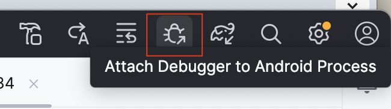
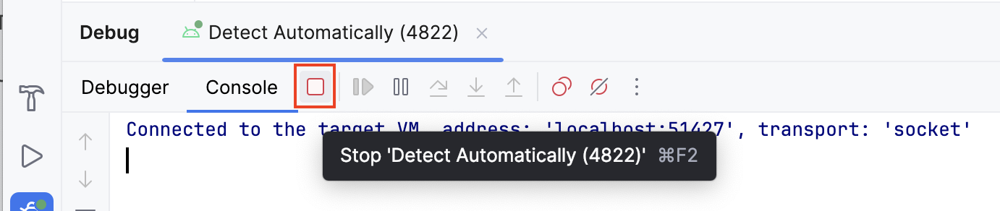
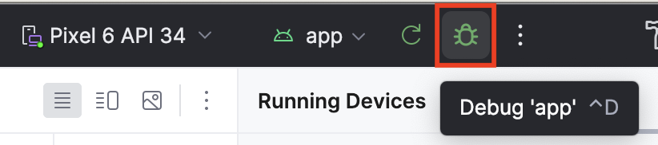

# Use the debugger in Android Studio

## Run the Debugger

- Attach the debugger to an existing app process that runs on a device or emulator.
- Run the app with the debugger.

### Attach the debugger to an app process

If your app is already running, you can attach the debugger to it.

To attach the debugger to an app process, follow these steps:

1. Click **Attach Debugger to Android Process**.

2. Select `com.example.diceroller` and then click `OK`.

### Run the app with the debugger

To run the app with the debugger, follow these steps:

1. In the Debug pane, click **Stop**, and then close the app on the device or emulator.

2. Click **Debug ‘app'**.

## Use the debugger

[--TODO--]
