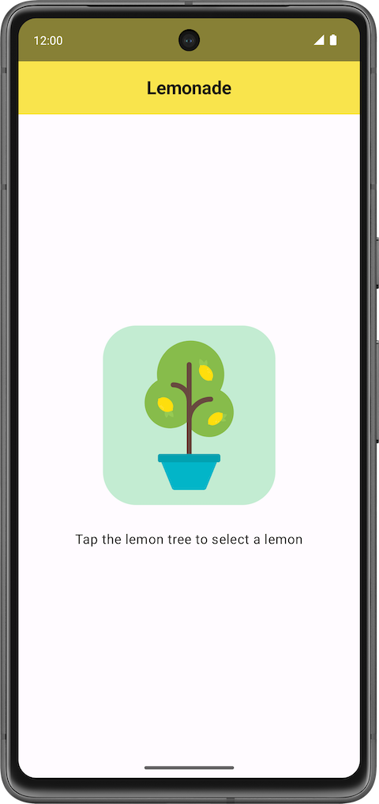
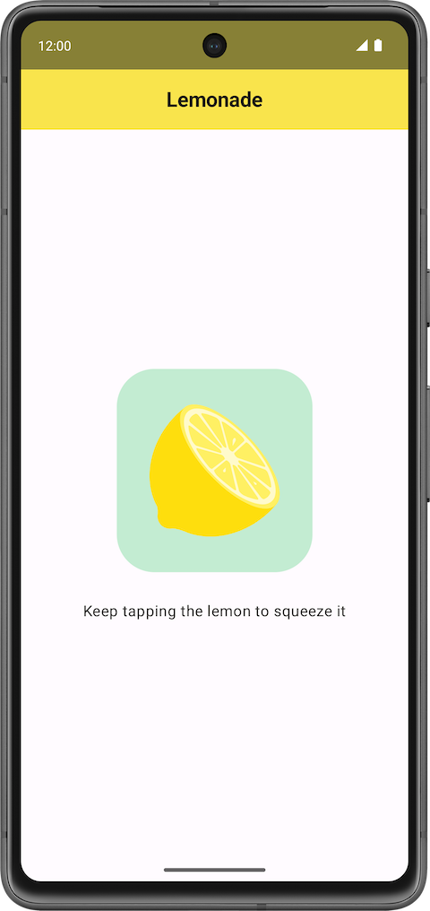
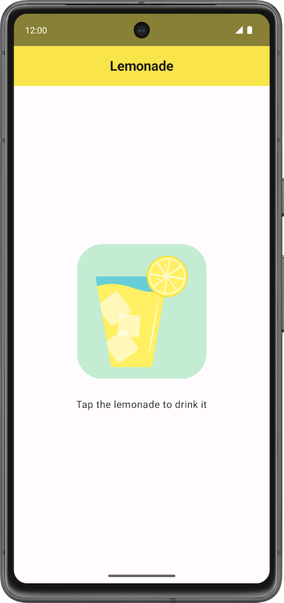
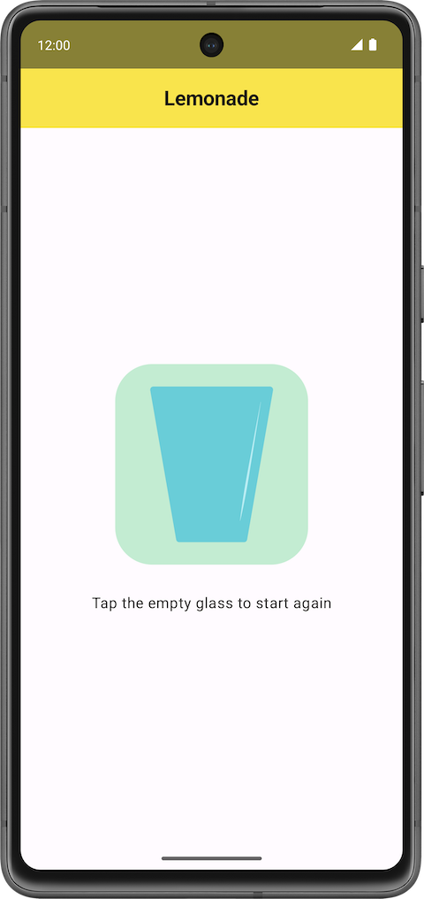
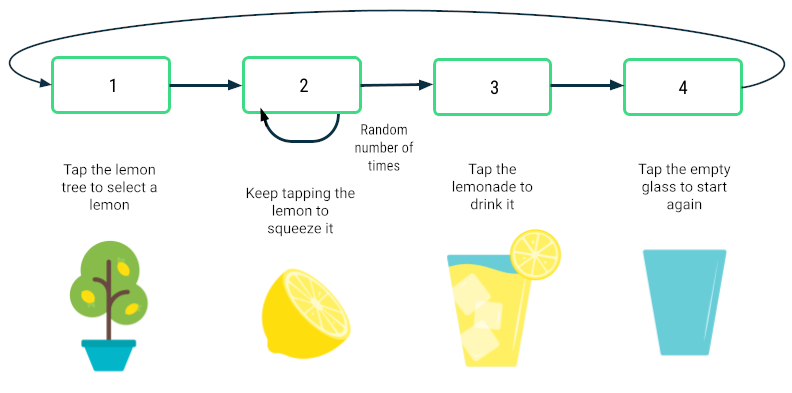

# The Lemonade App

## Create Project

In Android Studio, create a new project with the **Empty Activity** template with the following details:

- Name: Lemonade
- Package name: com.example.lemonade
- Minimum SDK: 24

## Add images

1. Download a [zip file of the images](https://github.com/google-developer-training/basic-android-kotlin-compose-training-lemonade/raw/main/lemonade_images.zip) for the app.
2. Double click the zip file. This step unzips the images into a folder.
3. Add the images into the drawable folder of your app.

## Add string resources

Add the following strings to your project in the **res** > **values** > **strings.xml** file:

- `Tap the lemon tree to select a lemon`
- `Keep tapping the lemon to squeeze it`
- `Tap the lemonade to drink it`
- `Tap the empty glass to start again`

Add these additional strings in your app's **strings.xml** file:

- `Lemon tree`
- `Lemon`
- `Glass of lemonade`
- `Empty glass`

## Steps of making lemonade

### Step 1:

Text: `Tap the lemon tree to select a lemon`
Image: Lemon tree (`lemon_tree.xml`)



### Step 2:

Text: `Keep tapping the lemon to squeeze it`
Image: Lemon (`lemon_squeeze.xml`)



### Step 3:

Text: `Tap the lemonade to drink it`
Image: Full glass of lemonade (`lemon_drink.xml`)



### Step 4:

Text: `Tap the empty glass to start again`
Image: Empty glass (`lemon_restart.xml`)



## Add visual polish

- Increase the font size of the text so that it's larger than the default font size (such as `18sp`).
- Add additional space in between the text label and the image below it, so they're not too close to each other (such as `16dp`).
- Give the button an accent color and slightly rounded corners to let the users know that they can tap the image.

## Plan out how to build the app



## Create Dimension file

1. Right click on **app** (Root) -> **New** -> **Android Resouce file**
2. File Name: `dimens`
3. Resource Type: `Values`
4. **Ok**

The `dimens.xml` file will be created in `app/res/values` directory.

5. Update the `dimens.xml` file as follows:

```xml
<?xml version="1.0" encoding="utf-8"?>
<resources>
    <dimen name="button_corner_radius">40dp</dimen>
    <dimen name="button_interior_padding">24dp</dimen>
    <dimen name="padding_vertical">32dp</dimen>
    <dimen name="button_image_width">128dp</dimen>
    <dimen name="button_image_height">160dp</dimen>
</resources>
```

6. Update the `strings.xml` file as follows:

```xml
<resources>
    <string name="app_name">Lemonade</string>
    <string name="lemon_select">Tap the lemon tree to select a lemon</string>
    <string name="lemon_squeeze">Keep tapping the lemon to squeeze it</string>
    <string name="lemon_drink">Tap the lemonade to drink it</string>
    <string name="lemon_empty_glass">Tap the empty glass to start again</string>
    <string name="lemon_tree_content_description">Lemon tree</string>
    <string name="lemon_content_description">Lemon</string>
    <string name="lemonade_content_description">Glass of lemonade</string>
    <string name="empty_glass_content_description">Empty glass</string>
</resources>
```

## Complete code

File: `MainActivity.kt`

```kt
package com.example.lemonade

import android.os.Bundle
import androidx.activity.ComponentActivity
import androidx.activity.compose.setContent
import androidx.activity.enableEdgeToEdge
import androidx.compose.foundation.Image
import androidx.compose.foundation.background
import androidx.compose.foundation.layout.Arrangement
import androidx.compose.foundation.layout.Box
import androidx.compose.foundation.layout.Column
import androidx.compose.foundation.layout.Spacer
import androidx.compose.foundation.layout.fillMaxSize
import androidx.compose.foundation.layout.height
import androidx.compose.foundation.layout.padding
import androidx.compose.foundation.layout.width
import androidx.compose.foundation.shape.RoundedCornerShape
import androidx.compose.material3.Button
import androidx.compose.material3.ButtonDefaults
import androidx.compose.material3.CenterAlignedTopAppBar
import androidx.compose.material3.ExperimentalMaterial3Api
import androidx.compose.material3.MaterialTheme
import androidx.compose.material3.Scaffold
import androidx.compose.material3.Surface
import androidx.compose.material3.Text
import androidx.compose.material3.TopAppBarDefaults
import androidx.compose.runtime.Composable
import androidx.compose.runtime.getValue
import androidx.compose.runtime.mutableIntStateOf
import androidx.compose.runtime.remember
import androidx.compose.runtime.setValue
import androidx.compose.ui.Alignment
import androidx.compose.ui.Modifier
import androidx.compose.ui.res.dimensionResource
import androidx.compose.ui.res.painterResource
import androidx.compose.ui.res.stringResource
import androidx.compose.ui.text.font.FontWeight
import androidx.compose.ui.tooling.preview.Preview
import com.example.lemonade.ui.theme.LemonadeTheme

class MainActivity : ComponentActivity() {
    override fun onCreate(savedInstanceState: Bundle?) {
        super.onCreate(savedInstanceState)
        enableEdgeToEdge()
        setContent {
            LemonadeTheme {
                LemonadeApp()
            }
        }
    }
}

@OptIn(ExperimentalMaterial3Api::class)
@Preview(showBackground = true)
@Composable
fun LemonadeApp(modifier: Modifier = Modifier) {
    var currentStep by remember { mutableIntStateOf(1) }
    var squeezeCount by remember { mutableIntStateOf(0) }

    Scaffold(
        topBar = {
            CenterAlignedTopAppBar(
                title = {
                    Text("Lemonade", fontWeight = FontWeight.Bold)
                },
                colors = TopAppBarDefaults.topAppBarColors(
                    containerColor = MaterialTheme.colorScheme.primaryContainer
                )
            )
        }
    ){
        innerPadding ->
        Surface (
            modifier = Modifier
                .fillMaxSize()
                .padding(innerPadding)
                .background(MaterialTheme.colorScheme.tertiaryContainer),
            color = MaterialTheme.colorScheme.background
        ) {
            when(currentStep) {
                1 -> {
                    LemonTextAndImage(
                        textLabelResourceId = R.string.lemon_select,
                        drawableResourceId = R.drawable.lemon_tree,
                        contentDescriptionResourceId = R.string.lemon_tree_content_description,
                        onImageClick = {
                            currentStep = 2
                            squeezeCount = (2..4).random()
                        }
                    )
                }
                2 -> {
                    LemonTextAndImage(
                        textLabelResourceId = R.string.lemon_squeeze,
                        drawableResourceId = R.drawable.lemon_squeeze,
                        contentDescriptionResourceId = R.string.lemon_content_description,
                        onImageClick = {
                            squeezeCount--
                            if (squeezeCount == 0) {
                                currentStep = 3
                            }
                        }
                    )
                }
                3 -> {
                    LemonTextAndImage(
                        textLabelResourceId = R.string.lemon_drink,
                        drawableResourceId = R.drawable.lemon_drink,
                        contentDescriptionResourceId = R.string.lemonade_content_description,
                        onImageClick = {
                            currentStep = 4
                        }
                    )
                }
                4 -> {
                    LemonTextAndImage(
                        textLabelResourceId = R.string.lemon_empty_glass,
                        drawableResourceId = R.drawable.lemon_restart,
                        contentDescriptionResourceId = R.string.empty_glass_content_description,
                        onImageClick = {
                            currentStep = 1
                        }
                    )
                }
            }
        }
    }
}

@Composable
fun LemonTextAndImage(
    textLabelResourceId: Int,
    drawableResourceId: Int,
    contentDescriptionResourceId: Int,
    onImageClick: () -> Unit,
    modifier: Modifier = Modifier
) {
    Box(
        modifier = modifier,
    ) {
        Column (
            horizontalAlignment = Alignment.CenterHorizontally,
            verticalArrangement = Arrangement.Center,
            modifier = Modifier.fillMaxSize()
        ) {
            Button(
                onClick = onImageClick,
                shape = RoundedCornerShape(dimensionResource(R.dimen.button_corner_radius)),
                colors = ButtonDefaults.buttonColors(containerColor = MaterialTheme.colorScheme.tertiaryContainer)
            ) {
                Image(
                    painter = painterResource(drawableResourceId),
                    contentDescription = stringResource(contentDescriptionResourceId),
                    modifier = Modifier
                        .width(dimensionResource(R.dimen.button_image_width))
                        .height(dimensionResource(R.dimen.button_image_height))
                        .padding(dimensionResource(R.dimen.button_interior_padding))
                )
            }
            Spacer(modifier = Modifier.height(dimensionResource(R.dimen.padding_vertical)))
            Text(
                text = stringResource(textLabelResourceId),
                style = MaterialTheme.typography.bodyLarge
            )
        }
    }
}
```
